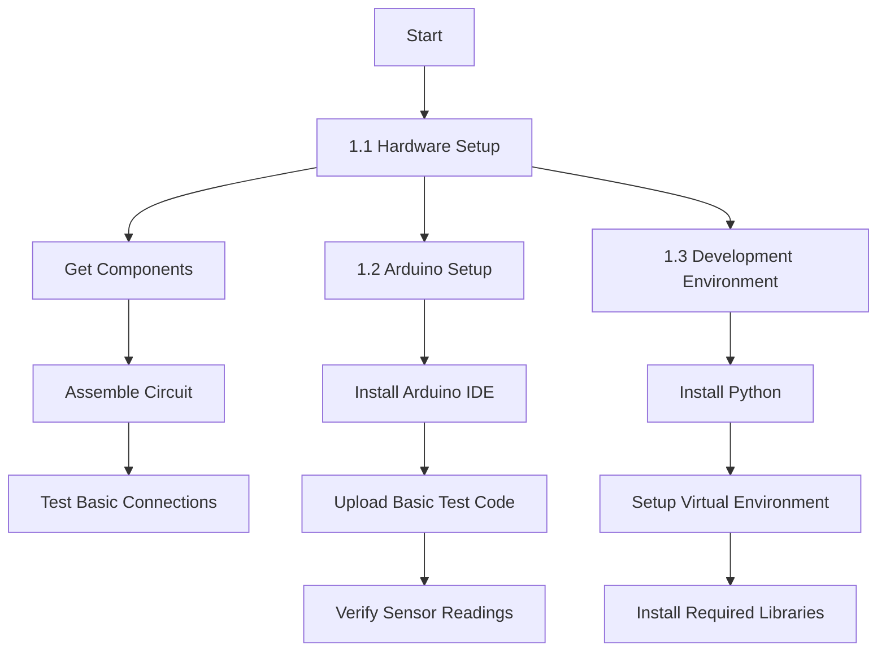
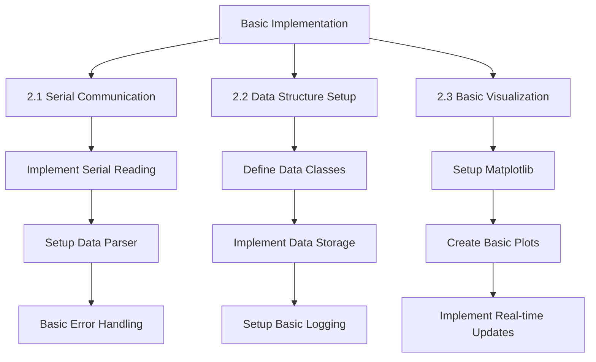
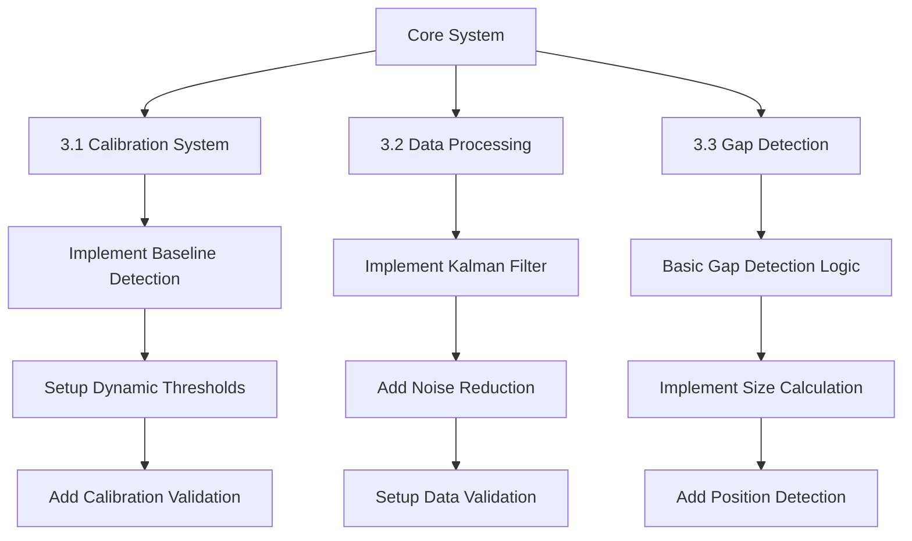
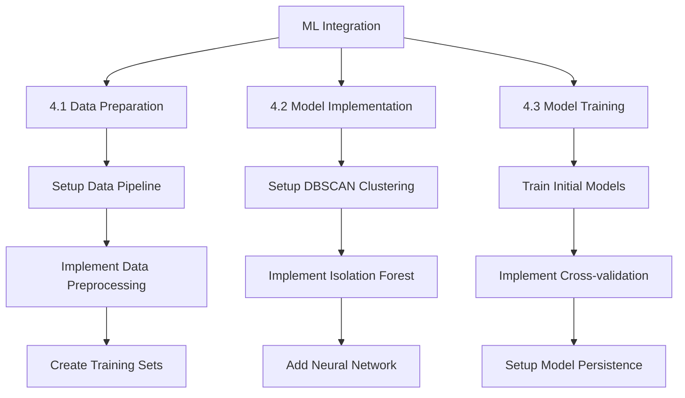
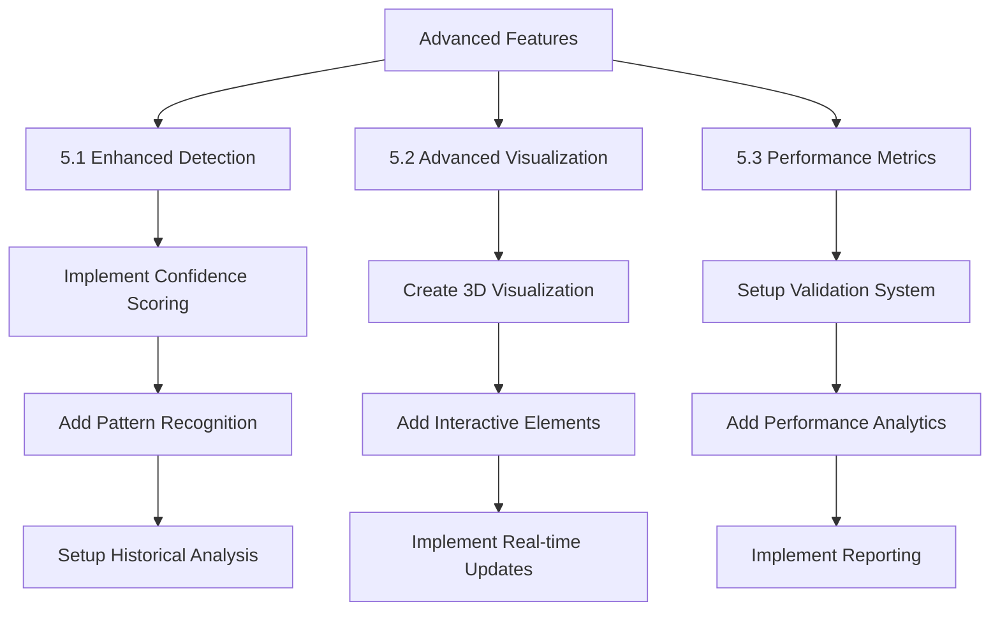
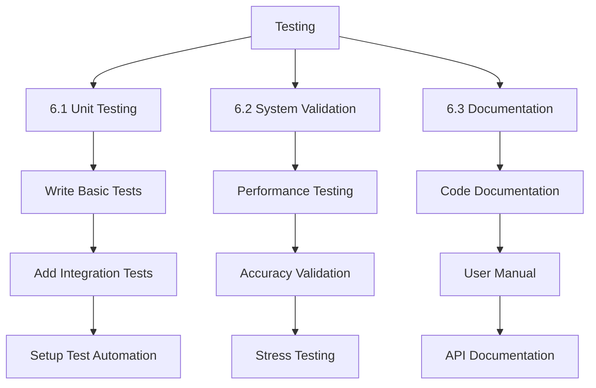
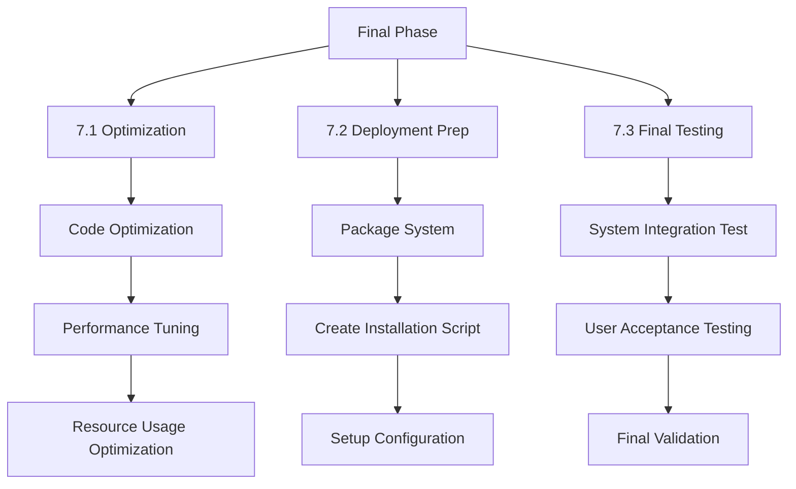

# Gap Detection System - Project Implementation Roadmap

## Phase 1: Project Setup and Hardware Integration 🛠️

## Phase 2: Basic System Implementation 💻

## Phase 3: Core Detection System 🎯

## Phase 4: Machine Learning Integration 🧠

## Phase 5: Advanced Features Development 🚀

## Phase 6: Testing and Validation ✅

## Phase 7: Optimization and Deployment 🌟

## Timeline and Dependencies 📅

### Critical Path
1. Hardware Setup → Basic Implementation → Core Detection System
2. Data Processing → ML Integration → Advanced Features
3. Testing → Optimization → Deployment

### Estimated Timeline
- Phase 1: 1-2 weeks
- Phase 2: 2-3 weeks
- Phase 3: 3-4 weeks
- Phase 4: 3-4 weeks
- Phase 5: 2-3 weeks
- Phase 6: 2-3 weeks
- Phase 7: 1-2 weeks

Total Estimated Time: 14-21 weeks

### Key Milestones 🏆
1. ✅ Hardware System Operational
2. ✅ Basic Detection System Working
3. ✅ ML Models Integrated
4. ✅ Advanced Features Implemented
5. ✅ System Validated and Tested
6. ✅ System Deployed and Documented

### Resources Required 📚
1. Hardware Components:
   - Arduino Board
   - Ultrasonic Sensor
   - Servo Motor
   - Connecting Components

2. Software Requirements:
   - Python 3.8+
   - Arduino IDE
   - Required Python Libraries
   - Development Tools

3. Development Resources:
   - Development Computer
   - Testing Environment
   - Documentation Tools

### Risk Management 🎲
1. Hardware Risks:
   - Component Failure
   - Calibration Issues
   - Environmental Interference

2. Software Risks:
   - Performance Issues
   - Algorithm Accuracy
   - Integration Problems

3. Mitigation Strategies:
   - Regular Testing
   - Backup Components
   - Robust Error Handling
   - Continuous Validation

